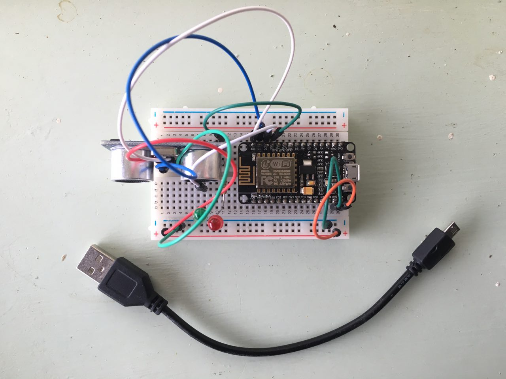

# Tutorial: How to create a televsion distance parental control interface with NodeMCU

If you want to check up on your kiddos watching television while you're not at home, this is a solution that might come in handy.
Kids don't realize sitting close to the television is bad for your eyes. Therefore I've created an interface to show you how close your
kid is to the television between a period of time. Everytime your kid comes too close to the televison it will be monitored and send to
the dashboard. This is a guide showing you how to use this and what tools you need to start parenting and caring over your child even better.

### Requirements

#### Hardware
-----------------

- 1 NodeMCU (with WiFi)
- 1 green led light
- 1 red led light
- 2 resistors for the leds
- 1 breadboard (big or small)
- 8 circuit wires
- [HC-SR04 ultra distance sensor](http://www.hackerstore.nl/Afbeeldingen/95klein.jpg)
- USB to Micro-USB B cable (to connect NodeMCU to computer)

##### Arduino setup



| Sensor/Output  | Port         | 
| ------------- |:-------------:| 
| Echo pin      | D0            | 
| Trigger pin   | D1            | 
| Green led     | D2            | 
| BUILTIN_LED   | BUILTIN_LED   | 
| Red led       | D3            |

#### Software
-----------------

**Programs**
- Arduino (downloaded from: https://www.arduino.cc/en/Main/Software)

**Libraries**
- [ArduinoJson](https://github.com/bblanchon/ArduinoJson)
- [ESP8266WiFi](https://github.com/ekstrand/ESP8266wifi)

### Step 1: Installing

- Open up **arduino.ino** with your Arduino app
- Add WiFi SSID and password information

```
// WiFi
const char* ssid     = "";  // Wifi SSID
const char* password = "";  // WiFi Password
```

- Change the path of your host

```
// Hosts
const char* host     = ""; // Your domain EG: iot.nodemcu.com
String path          = "/api/status/output";
const int httpPort   = 80;
```

### Server 

### API

All data send to the server is stored in JSON files. The API delivers 3 kinds of data:

- History
- Led status
- Last measured distance

##### History

Returns JSON file with history of all measured distances from television.

```
[
  { 
    "time": "2016-04-21 00:21:29", 
    "input": { "distance": 50 }, 
    "output": { "led": "red" } 
  },
  ...
]

```

##### Led

Returns JSON file with history of all measured distances from television.
```
[
  { 
    "time": "2016-04-21 00:21:29", 
    "input": { "distance": 50 }, 
    "output": { "led": "red" } 
  },
  ...
]

```

##### Distance
