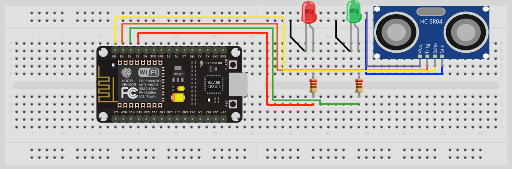
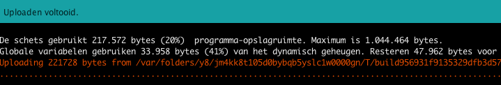
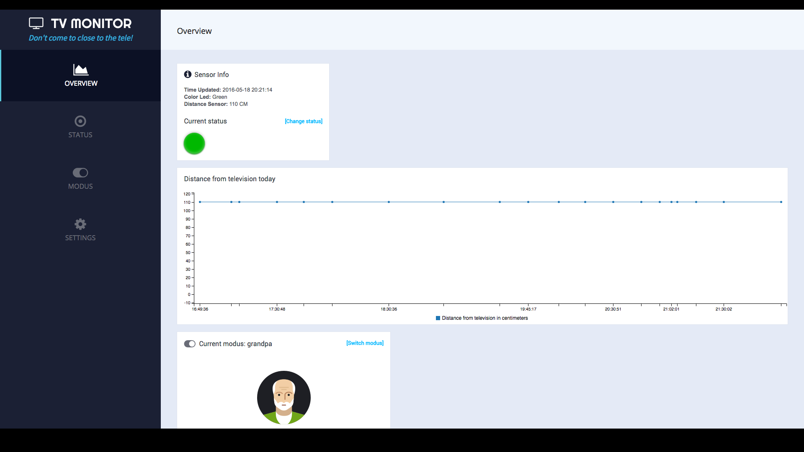
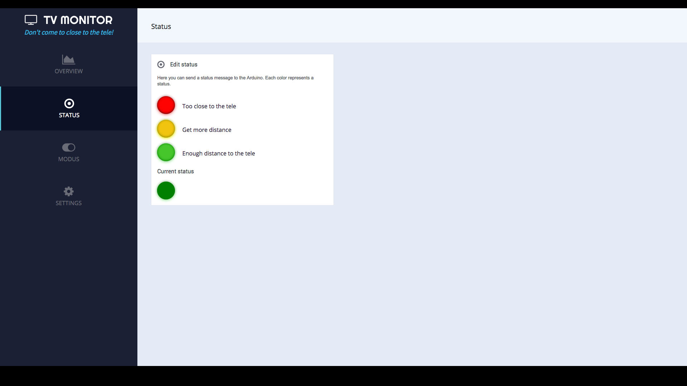
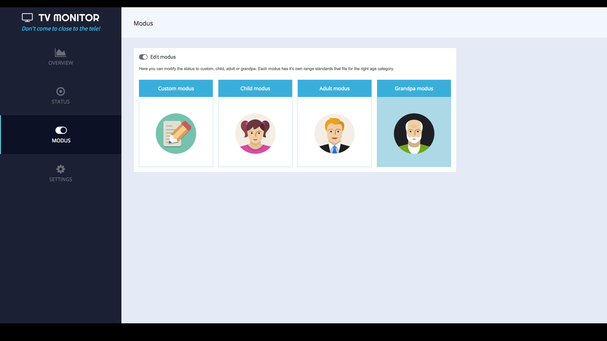
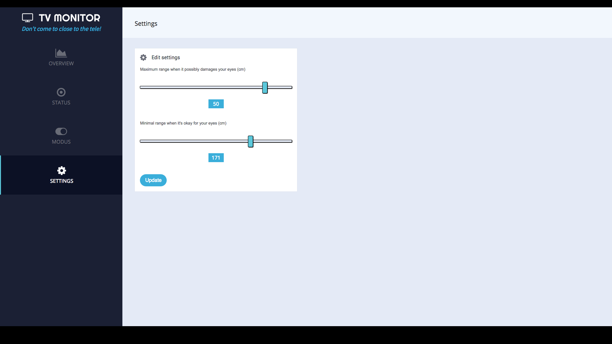

# Tutorial: Showing how to setup a television distance meter interface with a NodeMCU

If you want to check up on your family watching television while you're not at home, this solution might come in handy.
People don't realize sitting close to the television is bad for your eyes. Therefore I've created an interface to check up on how far away someone is to the television between a period of time. Everytime someone is too close to the televison it will be monitored and send to the dashboard. This manual shows you how to monitor the distance using a sensor with Arduino soft- and hardware and display this data in a web-interface. This interface contains a realtime chart where you can see all distances measured today.

For this tutorial you require a basic understanding of:

- The programming language C++ (or JavaScript)
- How to work with your terminal in Window or Mac
- How to set up a own live Node server (if you want to communicate with a live environment server)

### Table of contents

1. Requirements
2. Step 1: Installing Arduino
3. Step 2: Installing server
4. Interface 
5. Server code architecture
6. API
7. Demo

### Requirements

#### Hardware
-----------------

- 1 NodeMCU (with WiFi)
- 1 green led light
- 1 red led light
- 2 resistors for the leds
- 1 breadboard (big or small)
- 8 circuit wires
- [HC-SR04 ultra distance sensor](http://www.hackerstore.nl/Afbeeldingen/95klein.jpg)
- USB to Micro-USB B cable (to connect NodeMCU to computer) 

##### HC-SR04 sensor


##### Arduino setup


##### Arduino sketch



| Sensor/Output  | Port         | 
| ------------- |:-------------:| 
| Echo pin      | D0            | 
| Trigger pin   | D1            | 
| Green led     | D2            | 
| Red led       | D3            |
| BUILTIN_LED   | BUILTIN_LED   |

#### Software for Arduino
-----------------

**Programs**

You can download the Arduino software at the [official site](https://www.arduino.cc/en/Main/Software) of Arduino.
Install the software by following the standard installation procedure and launch the program after it's finished.

**Arduino code**

The Arduino code you need for this project is located in the [Arduino folder](https://github.com/strexx/IoT-NodeMCU/blob/iot-feature-fons/arduino/arduino.ino) of this repository.

**Libraries**
- [ArduinoJson](https://github.com/bblanchon/ArduinoJson)
- [ESP8266WiFi](https://github.com/ekstrand/ESP8266wifi)

### Step 1: Installing Arduino software

- Open up your Arduino editor which you have downloaded earlier if you haven't already done that.

- Next we need to install the necessary driver so the Arduino software can work with the NodeMCU board.
1. Go to Arduino > Preferences (in the menubar)


Add the following link at the "Additional Boards Manager URLs".

```
http://arduino.esp8266.com/stable/package_esp8266com_index.json
```


2. Go to Tools > Board > Boardmanager (in the menubar).

3. Search for 'esp'.

4. Select the block and click 'install'.


5. The drivers should be installed now.

6. Go to tools and make sure your settings look like this:


### Step 2: Running Arduino

Now we have setup our Arduino and it's software it's time to run the code!

- Open up **arduino.ino** in ```arduino/arduino.ino```
- Add WiFi SSID and password information

```
// WiFi
const char* ssid     = "";  // Wifi SSID
const char* password = "";  // WiFi Password
```

- Change the path of your host

```
// Hosts
const char* host     = ""; // Your domain EG: iot.nodemcu.com
String path          = "/api/status/output"; // This is the path where the Arduino will GET data
const int httpPort   = 80; // HTTP Port
```

- Upload the arduino code to your NodeMCU

You should be seeing this at the bottom of your Arduino app:



Now your NodeMCU will connect to your WiFi and will **GET** and **POST** data to your server every 30 seconds.

### Step 2: Installing server

Now lets setup our server. This tutorial will show you how to set it up locally. This tutorial won't explain how to set up this server on a live environment with an own domain. Take a look at [Digital Ocean](https://www.digitalocean.com/) on how to set up a live environment.
You also need to install some Javascript tools in order to run this project:

#### Software requirements for server

- [Nodejs](https://nodejs.org/en/) which is needed to setup our local server.
- [Gulp](https://github.com/gulpjs/gulp/blob/master/docs/getting-started.md) which is needed to run some automatic tasks.
- [NPM](https://www.npmjs.com/) which is needed to and install dependencies.

#### Setup

- Open up terminal and open this project

```
cd /path-to-file
```

- In this folder install node modules

```
npm install
```

You can find more information at the [official website](https://github.com/gulpjs/gulp/blob/master/docs/getting-started.md) of Gulp.

- Install Gulp

```
npm install --global gulp-cli
```

- Open new tab
- Start Gulp

```
gulp watch
```

- Start the application from the root folder

```
npm start
```

If you open your browser and go to **http://localhost:3010/** you should see the app running.

**Important:** Again, this is on a **local** server, not on a live environment.

------

### Interface

##### Overview



On the overview page you'll see a dashboard where you can see the status, modus and latest information about the sensor wrapped in one single page. This page also contains a realtime chart where you can see distances measured from the television today.

##### Status



On the status page it's possible to see whether the person that is watching television is keeping enough distance. If this is not the case you can send them a status message by clicking on one of the status buttons:

**Green**

On a green light the person keeps enough distance from the television.

**Yellow**

On a yellow light the person keeps just enough distance from the television.

**Red**

On a yellow light the person is too close to the televsion and should keep more distance.

##### Modus



The interface heeft 4 modussen gebaseerd op leeftijdscategorie. Elke modus heeft zijn eigen minimale en maximale afstand die voor de betreffende leeftijdscategorie gewenst zijn.

The interface has four types of modes based on age category. Each modus has it's own minimum and maximum range that fits in for the right age category.

**Custom mode**

This will adapt the custom settings which can be managed at the settings page.

**Child mode**

This is a pre defined mode that has it's own range standards that is best for children.
The grandpa mode now uses a 70 cm minimal range and a 120 cm maximum range.

**Adult mode**

This is a pre defined mode that has it's own range standards that is best for adults.
The grandpa mode now uses a 50 cm minimal range and a 90 cm maximum range.

**Grandpa mode**

This is a pre defined mode that has it's own range standards that is best for grandparents.
The grandpa mode now uses a 30 cm minimal range and a 70 cm maximum range.

##### Settings



On the settings page you can configure your own desired minimum and maximum range for your sensor. You can activate these settings by changing the mode to "custom mode" on the modus page.

### Server code architecture

```
/IoT-NodeMCU
  /methods
    /methods.js       -> Returns last object of an array
  /public             
    /src              -> CSS/JS files
  /resources          
    /data.json        -> File where all data will be stored
  /routes
    /api.js           -> Server logic for the API
    /index.js         -> Router logic for the main page
  /views
    /error.hbs        -> Error page for pages that don't exist
    /layout.hbs       -> Base layout where content will be rendered in <main>
    /main.hbs         -> Overview page
    /modus.hbs        -> Modus page
    /settings.hbs     -> Settings page
    /status.hbs       -> Status page
  /app.js             -> Main app configuration and initialize app
```

### API

All data send to the server is stored in JSON files. The API delivers 3 kinds of data:

- History
- Led status
- Last measured distance

#### History

**/api/data** Returns JSON with information of all measured distances from television.

```
[
  { 
    "time": "2016-04-21 00:21:29", 
    "input": { "distance": 50 }, 
    "output": { "led": "red" },
    "settings": { "red": "50", "green": "100" },
    "modus": "custom || child || adult || grandpa"
  },
  ...
]

```

#### Led

**/api/status/output** Returns JSON with current LED status.

```
{ 
  "led": "red"
}
```

**/api/status/input** Returns JSON with latest distance measured.

#### Distance

```
{ 
  "distance": 50
}
```

### Demo

A demo of this project is available at: [iot.fons.alleenmedia.nl](http://www.iot.fons.alleenmedia.nl)

##### Edited by: Fons Hettema
